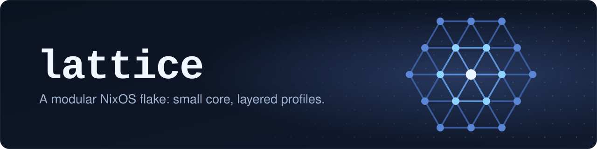

<p align="center">
  
</p>

<p align="center">
  <a href="https://nixos.org"></a>
  <a href="https://github.com/Mic92/sops-nix"></a>
  <a href="https://github.com/TWinston-66/lattice/commits/main"></a>
  <a href="LICENSE"></a>
</p>

My NixOS machines, as one flake. Every host gets a small core, and everything
else is layered on through modules and profiles.

## Layout

| Path | What it holds |
| --- | --- |
| `hosts/<host>/` | Per-host config and its generated `hardware-configuration.nix` |
| `modules/nixos/base.nix` | The core: Nix, users, secrets, locale. No remote access |
| `modules/nixos/remote-managed.nix` | Key-only SSH, for hosts deployed remotely |
| `modules/nixos/dotfiles.nix` | Packages and shell for my [dotfiles](https://github.com/TWinston-66/.dotfiles) |
| `modules/nixos/profiles/` | `laptop`, `graphical` and `server` |
| `secrets/` | [sops](https://github.com/getsops/sops)-encrypted secrets |
| `scripts/` | Deploy, rebuild and password helpers |

## Usage

```sh
scripts/deploy.sh [host] [ip]            # build and switch a host over SSH
scripts/rebuild.sh [host]                # build and switch this machine
scripts/set-password.sh [user]           # set a login password
nix develop -c sops secrets/common.yaml  # edit secrets
```

- `deploy.sh` evaluates locally and builds on the target, so the target needs
  no checkout. It pins the SSH host key to the host name, not the IP.
- Both switch scripts refuse a host that can't decrypt its secrets, since it
  would boot with every account locked.
- Scripts bring their own tools from the flake's dev shell.
- Secrets decrypt with an admin age key at `~/.config/sops/age/keys.txt`, or
  with each host's SSH host key. On macOS, set `XDG_CONFIG_HOME` or
  `SOPS_AGE_KEY_FILE` so sops finds the admin key.

## Adding a host

1. Install NixOS with a `winston` user. For remote access, also enable OpenSSH
   and give the user the deploy key and a password.
2. Copy `hardware-configuration.nix` into `hosts/<host>/`, and add a
   `default.nix` that imports `base.nix` plus the modules you want. Register
   the host in `flake.nix`, and in `scripts/deploy.sh` if it's remote.
3. Get the host's age key and add it to `.sops.yaml`:
   - Remote: `ssh-keyscan -t ed25519 <ip> | nix develop -c ssh-to-age`
   - Local: clone this repo (`nix-shell -p git`) and run
     `scripts/rebuild.sh <host>`. It prints the key.

   Then re-encrypt from an admin machine:
   `nix develop -c sops updatekeys secrets/common.yaml`
4. Switch it with `scripts/deploy.sh <host>`, or pull the re-encrypted secrets
   and run `scripts/rebuild.sh <host>` on the host.

## Recovery

Root is locked and passwords only come from sops. If a host can't decrypt its
secrets, or you forget its password, nothing on the machine will let you in.
Keep a NixOS USB stick around.

1. Boot the stick, unlock the LUKS devices with `cryptsetup open`, and mount the
   file systems under `/mnt` as `hardware-configuration.nix` describes.
2. From an admin machine, fix the cause. Either add the host's key
   (`/mnt/etc/ssh/ssh_host_ed25519_key.pub`) and run `updatekeys`, or set a new
   password with `scripts/set-password.sh`.
3. From a checkout with the fix, reinstall:

   ```sh
   sudo nixos-install --root /mnt --flake .#<host> --no-root-passwd \
     --option experimental-features 'nix-command flakes'
   ```

## License

[MIT](LICENSE)
