<p align="center">
  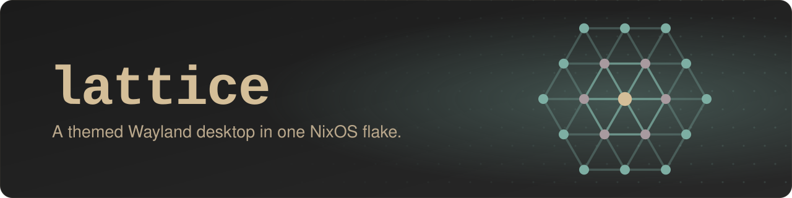
</p>

<p align="center">
  <a href="https://nixos.org"></a>
  <a href="https://hyprland.org"></a>
  <a href="https://asahilinux.org"></a>
  <a href="https://github.com/Mic92/sops-nix"></a>
  <a href="https://github.com/TWinston-66/lattice/commits/main"></a>
  <a href="LICENSE"></a>
</p>

<p align="center">
  <b>A complete, themed Wayland desktop, declared in one NixOS flake.</b><br>
  From the boot splash to the lock screen, every surface is built from the same palette and the same mark,
  on Intel laptops and Apple Silicon Macs alike.
</p>

<p align="center">
  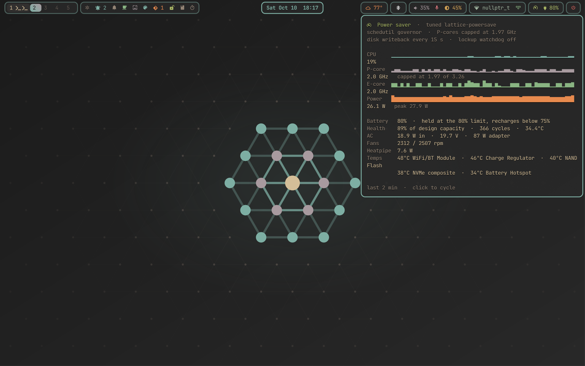
</p>

## Why lattice

- **One design, end to end.** Plymouth, the greeter, the console, the bar, menus,
  notifications, the lock screen, GTK and Qt apps, the terminal, Neovim, even the
  Stream Deck: all drawn from one palette and one geometric mark.
- **Switch themes live.** Seven dark flavours, fourteen accents and a matching wallpaper
  for each. Change them from the bar, and they apply without a rebuild or a logout.
- **Built for laptops.** Battery-aware refresh rates, charge limiting, measured
  suspend drain, smart hibernation, captive-portal sign-in and a guard against
  failed suspends.
- **Built for Apple Silicon.** M1 and M2 MacBooks on the Asahi kernel, with
  Widevine DRM, hardware video decode, tuned trackpad and keyboard, and display fixes
  carried as patches.
- **Reproducible and recoverable.** Every host is a flake output, and a new one starts
  from `hosts/macbook`. Secrets can live in sops, and then the system refuses to switch
  to a host that couldn't log anyone in.

## A tour

<table>
  <tr>
    <td width="50%">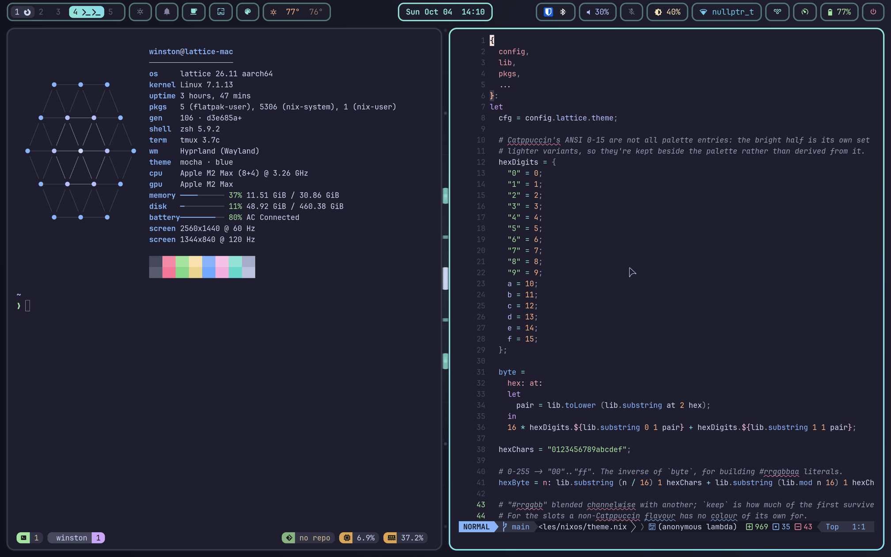</td>
    <td width="50%">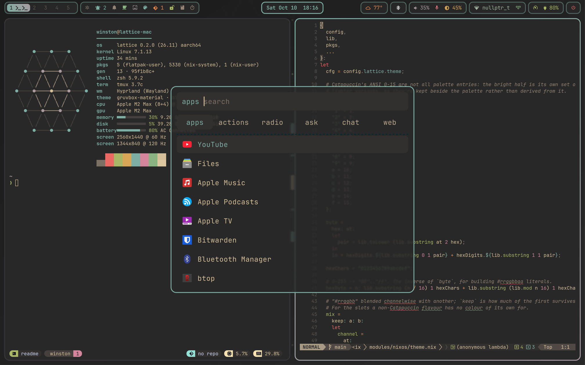</td>
  </tr>
  <tr>
    <td><b>Terminal-first.</b> foot, tmux, Neovim with DAP debugging, starship, fzf,
    bat, delta, lazygit and btop, all following the live theme.</td>
    <td><b>One launcher for everything.</b> rofi for apps, web apps, clipboard
    history, a libqalculate calculator, Wi-Fi, audio devices and more.</td>
  </tr>
  <tr>
    <td>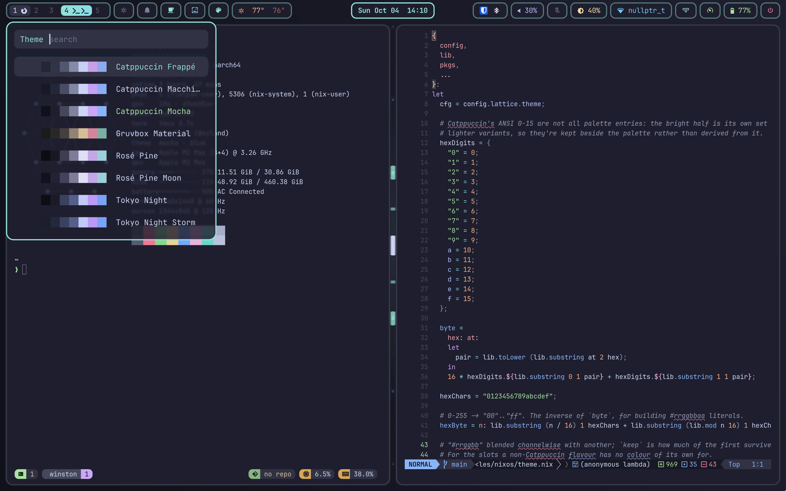</td>
    <td>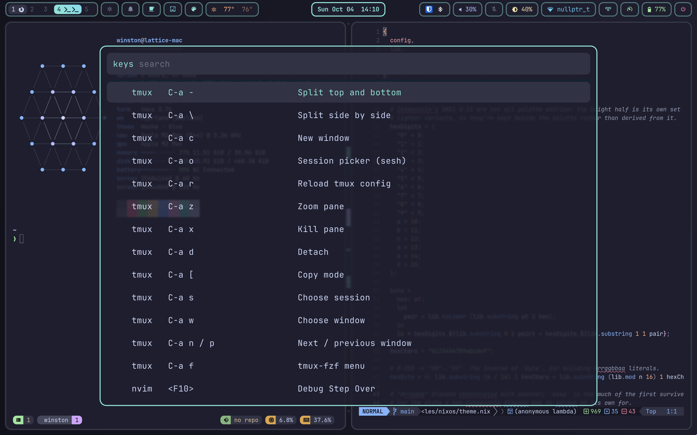</td>
  </tr>
  <tr>
    <td><b>Pick a theme from the bar.</b> Catppuccin Mocha, Macchiato and Frappé,
    Tokyo Night and Storm, Rosé Pine and Moon, and Gruvbox Material.</td>
    <td><b>Every shortcut, one keypress away.</b> <kbd>SUPER</kbd> + <kbd>/</kbd> lists
    each Hyprland, tmux and Neovim binding, read live from where it's defined.</td>
  </tr>
</table>

### The bar is the control panel

<table>
  <tr>
    <td width="50%">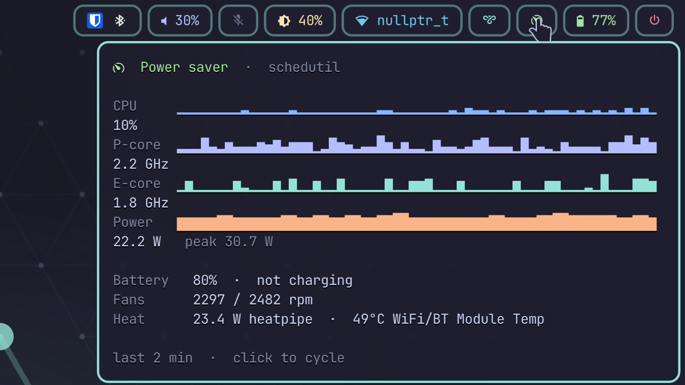</td>
    <td width="50%">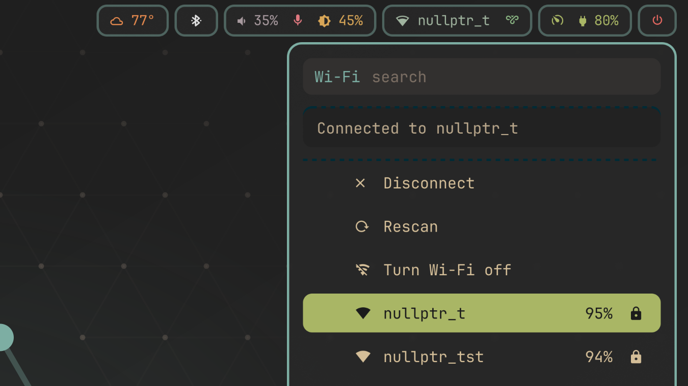</td>
  </tr>
  <tr>
    <td><b>Performance at a glance.</b> Hover the power-profile pill for two minutes of
    CPU load, P- and E-core clocks and package power, plus battery, fans and heat.
    Click it to cycle profiles.</td>
    <td><b>Wi-Fi without a tray applet.</b> Join, rescan, disconnect or switch the
    radio off from a rofi menu, and get a notification when the link changes.</td>
  </tr>
  <tr>
    <td>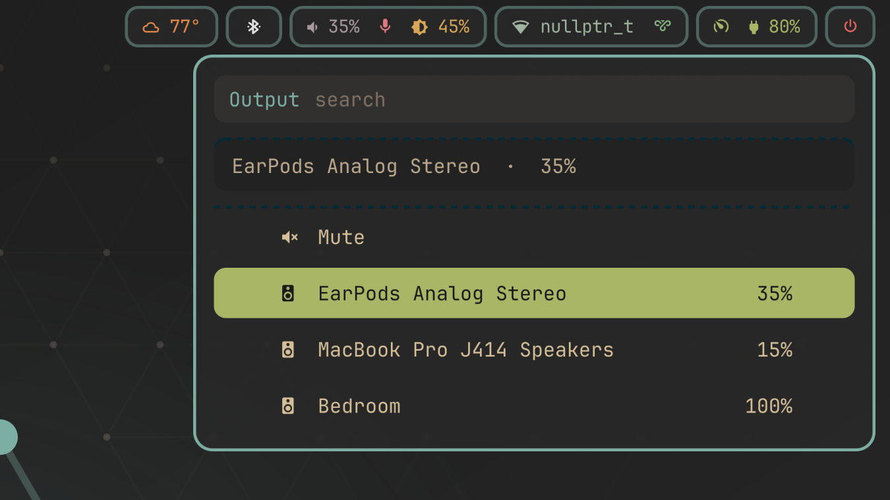</td>
    <td>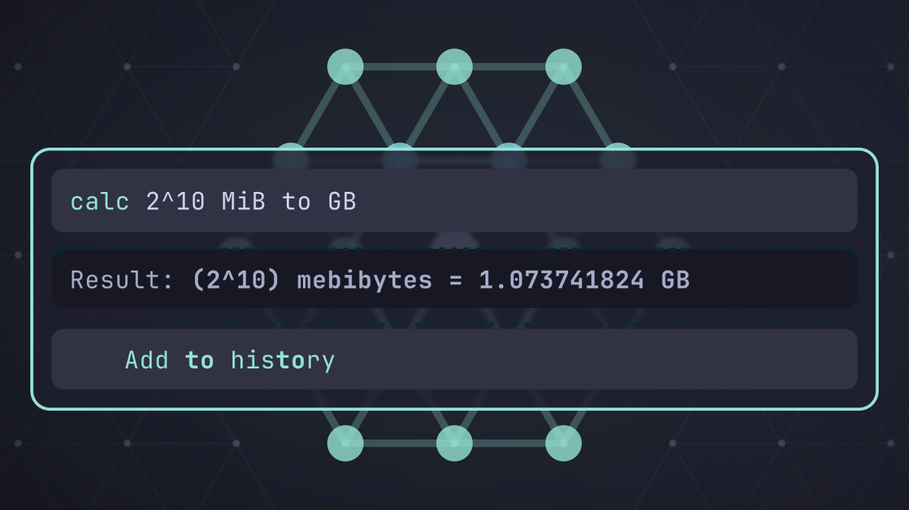</td>
  </tr>
  <tr>
    <td><b>Audio devices in one click.</b> Switching outputs or inputs moves whatever
    is already playing along with them.</td>
    <td><b>A real calculator in the launcher.</b> libqalculate handles units, conversions
    and algebra, and copies the result to the clipboard.</td>
  </tr>
</table>

### Lock and leave

<table>
  <tr>
    <td width="50%">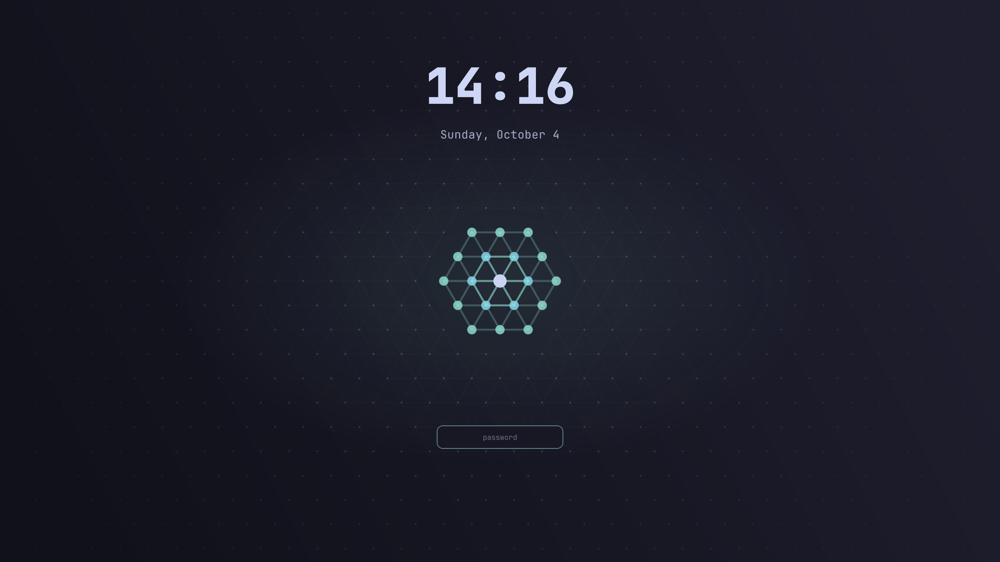</td>
    <td width="50%">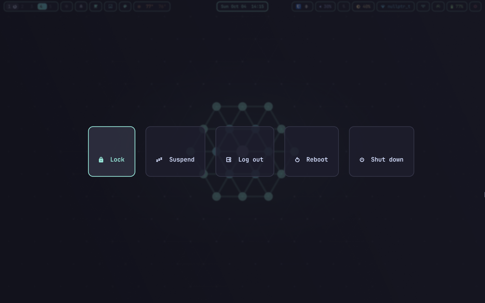</td>
  </tr>
  <tr>
    <td><b>hyprlock</b>, laid out around the wallpaper's mark. Its colours follow the
    live theme, and it shares the password box with the boot splash.</td>
    <td><b>The power menu</b>: lock, suspend, log out, reboot or shut down, sized to fit
    every attached screen. Hosts that hibernate get a sixth button.</td>
  </tr>
</table>

<p align="center">
  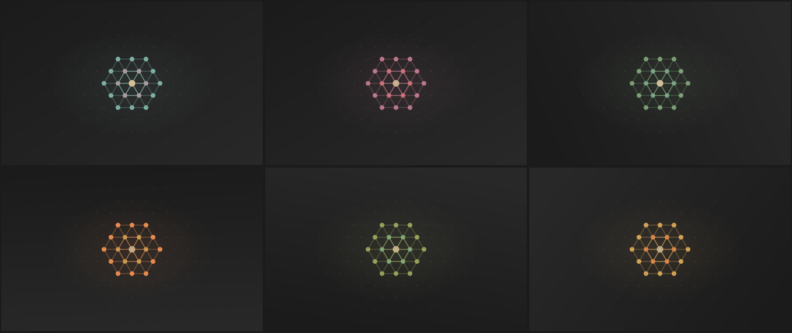
  <br><sub>The wallpapers aren't downloaded. <code>lattice art</code> draws them at build time, one per accent in each flavour, sized for each screen.</sub>
</p>

## What's inside

**Desktop.** Hyprland under UWSM, a waybar of clickable pills (Wi-Fi, audio, Tailscale,
weather, backups, power profiles with live graphs), mako notifications with do-not-disturb
and alerts for any failed unit, HyprQuickFrame screenshots with OCR, and chromeless web apps
that share your Firefox logins.

**Theming.** Seven flavours across Catppuccin, Tokyo Night, Rosé Pine and Gruvbox Material,
fourteen accents, and generated kits for GTK, Qt, icons, rofi, foot, tmux, Neovim,
Thunderbird and a dozen CLI tools. A silent Plymouth boot leads straight into a themed greeter.

**Hardware.** Stream Deck pages with generated key art and Home Assistant controls, Logitech
MX Master through Solaar, NuPhy keyboards over WebHID, and iPhone transfers over Taildrop.

**Laptops.** Charge limits, battery-aware refresh rates, measured suspend drain, captive-portal
sign-in, and an ambient light sensor driving the panel and keyboard on the Mac.

**Development.** `fhs`, a shell with a normal `/usr` for toolchains that expect one, plus
nix-ld, comma, `nh`, Docker and virtualization.

**Security and backups.** Root locked, passwords optionally pinned in sops-nix, SSH reachable
only over Tailscale when it is on, Bitwarden holding the SSH key, and hourly encrypted restic backups to an external
drive, taken from btrfs snapshots.

## Hosts

| Host | Hardware | Notes |
| --- | --- | --- |
| `macbook` | Any M1/M2 MacBook | The distro alone: what an install starts from |
| `mac` | The author's MacBook Pro | `macbook` plus `modules/personal`: sops secrets, Home Assistant, Stream Deck, books |

## Get started

Everything runs through one command: `lattice` lists it all, and zsh completes it.

```sh
lattice rebuild      # build this machine and switch
lattice theme        # next flavour, applied live
lattice doctor       # what, if anything, is wrong
lattice guide        # these guides, as a page
```

## Guides

| | |
| --- | --- |
| [Everyday use](docs/using.md) | The `lattice` command, rebuilding, secrets, themes |
| [Installing lattice](docs/install.md) | PCs, Apple Silicon Macs, and adding a host to the flake |
| [Backups](docs/backups.md) | Setting up the drive, getting files back, restoring a machine |
| [Recovery](docs/recovery.md) | When a host can't decrypt its secrets |
| [Configuring lattice](docs/configuring.md) | Where things live, the theme, your dotfiles |

On a running system, `lattice guide` opens them as a themed page with checkable steps and
commands that fill in your host names. Install and recovery read just as well here, for
when lattice isn't running yet.

## License

[MIT](LICENSE)
